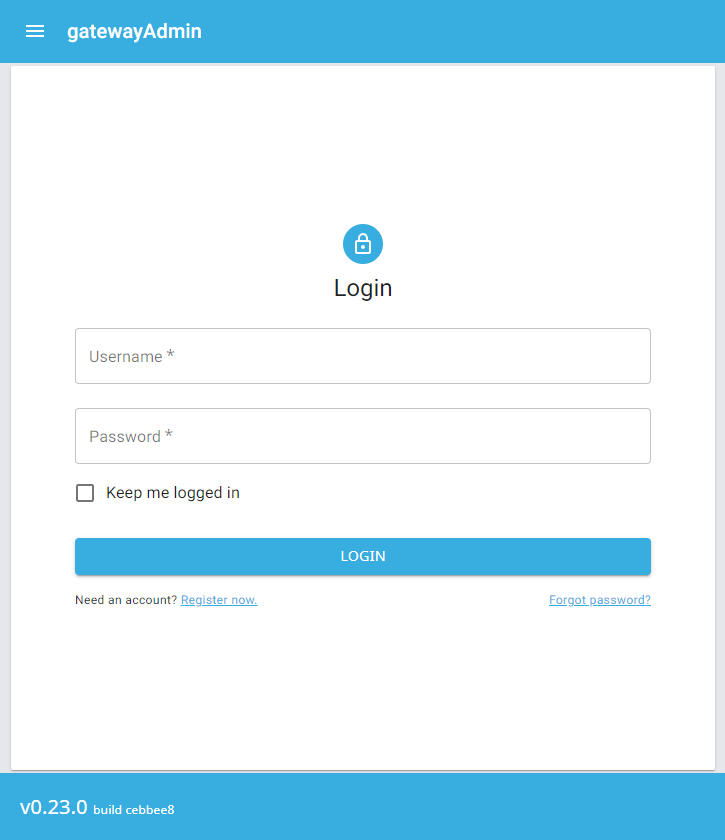
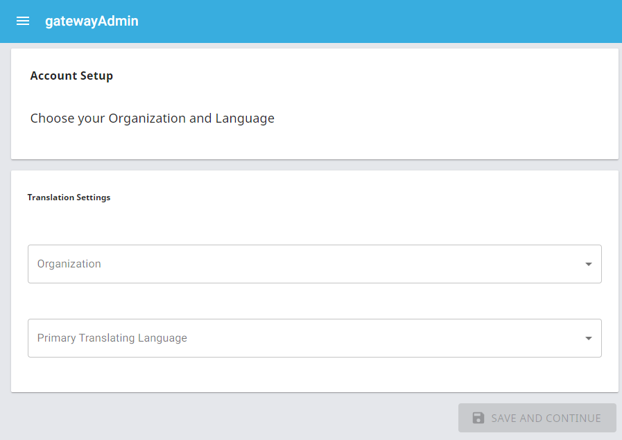
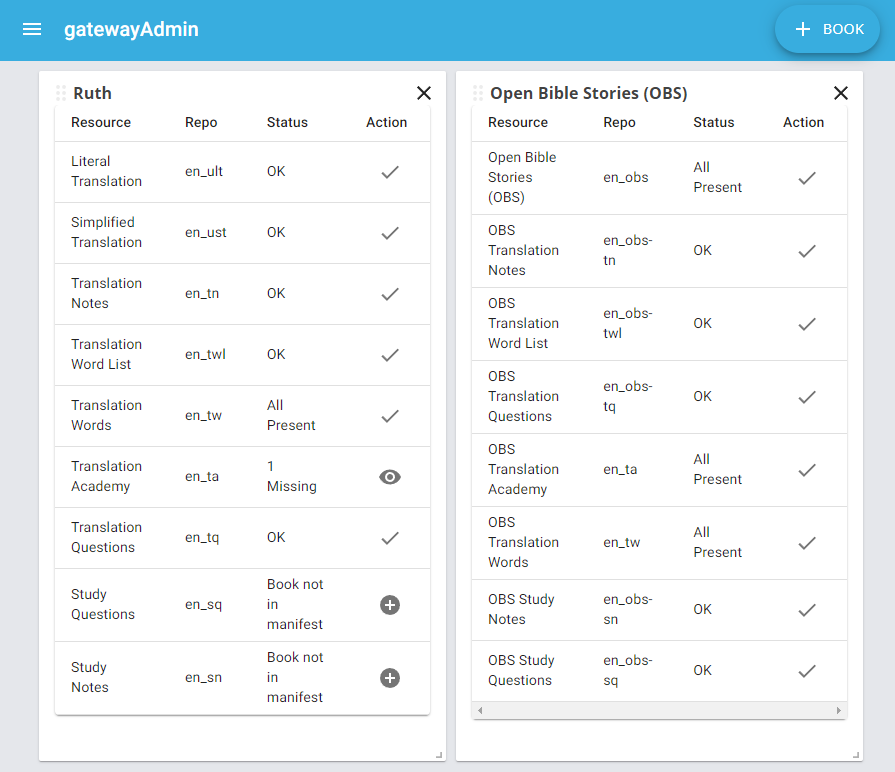

<div id="top"></div>
<!--
*** Thanks for checking out the Best-README-Template. If you have a suggestion
*** that would make this better, please fork the repo and create a pull request
*** or simply open an issue with the tag "enhancement".
*** Don't forget to give the project a star!
*** Thanks again! Now go create something AMAZING! :D
-->


<!-- PROJECT SHIELDS -->
<!--
*** I'm using markdown "reference style" links for readability.
*** Reference links are enclosed in brackets [ ] instead of parentheses ( ).
*** See the bottom of this document for the declaration of the reference variables
*** for contributors-url, forks-url, etc. This is an optional, concise syntax you may use.
*** https://www.markdownguide.org/basic-syntax/#reference-style-links
-->
[![Contributors][contributors-shield]](https://github.com/unfoldingWord/gateway-admin/graphs/contributors)
[![Forks][forks-shield]](https://github.com/unfoldingWord/gateway-admin/network/members)
[![Stargazers][stars-shield]](https://github.com/unfoldingWord/gateway-admin/stargazers)
[![Issues][issues-shield]](https://github.com/unfoldingWord/gateway-admin/issues)
[![MIT License][license-shield]](https://github.com/unfoldingWord/gateway-admin/blob/main/LICENSE)
[![LinkedIn][linkedin-shield]](https://www.linkedin.com/company/unfoldingword/)


<!-- PROJECT LOGO -->
<br />
<div align="center">
  <a href="https://gateway-admin.netlify.app/">
    
  </a>

<h3 align="center">gatewayAdmin</h3>

  <p align="center">
    This application is for use by Gateway Language Administrators.
    <br />
    <a href="https://github.com/unfoldingword/gateway-admin"><strong>Explore the docs »</strong></a>
    <br />
    <br />
    <a href="https://gateway-admin.netlify.app/">Go to Application</a>
    ·
    <a href="https://github.com/unfoldingword/gateway-admin/issues">Report Bug</a>
    ·
    <a href="https://github.com/unfoldingword/gateway-admin/issues">Request Feature</a>
  </p>
</div>


<!-- TABLE OF CONTENTS -->
<details>
  <summary>Table of Contents</summary>
  <ol>
    <li>
      <a href="#about-the-project">About The Project</a>
      <ul>
        <li><a href="#built-with">Built With</a></li>
      </ul>
    </li>
    <li>
      <a href="#getting-started">Getting Started</a>
      <ul>
        <li><a href="#prerequisites">Prerequisites</a></li>
        <li><a href="#installation">Installation</a></li>
      </ul>
    </li>
    <li><a href="#usage">Usage</a></li>
    <li><a href="#roadmap">Roadmap</a></li>
    <li><a href="#contributing">Contributing</a></li>
    <li><a href="#license">License</a></li>
    <li><a href="#contact">Contact</a></li>
    <li><a href="#acknowledgments">Acknowledgments</a></li>
  </ol>
</details>


<!-- ABOUT THE PROJECT -->
## About The Project
**Login Page**


**Setup Account**


**View Resources**


**Purpose**
To provide a tool to Translation Team Administrators to easily create Gitea repos, create/update manifests, run checks, etc.

**Problem**
The admins must be skilled Git users today and such activity is often error prone and time consuming.

**Scope**
- Current scope is focused on helping with Git and other translation backend requirements.
- It is envisioned that this tool might also:
  - Manage teams, translation assignments, issues, etc.
  - Provide a dashboard for at-a-glance status of translation projects

**Background**
The unfoldingWord training teams spent copious amounts of time dealing with backend Gitea requirements to support the translation tools. Ongoing, the teams also spent a lot of time and required IT support to manage backend issues.

<p align="right">(<a href="#top">back to top</a>)</p>

### Built With

* [Next.js](https://nextjs.org/)
* [React.js](https://reactjs.org/)

<p align="right">(<a href="#top">back to top</a>)</p>


<!-- GETTING STARTED -->
## Getting Started

This is an example of how you may give instructions on setting up your project locally.
To get a local copy up and running follow these simple example steps.

### Prerequisites

**Data**
- Must have an account on [DCS](https://git.door43.org)
- The source must be cloned from its repository (see above)
- `yarn install` is used to resolve/install dependencies
- `yarn dev` is used to start the local server listening on `localhost:3000`


### Installation/First Steps

1. Get a DCS account
2. Clone the repo
   ```sh
   git clone https://github.com/unfoldingword/gateway-admin.git
   ```
3. Install NPM packages
   ```sh
   yarn install
   ```
4. Enter your API in `config.js`
   ```js
   const API_KEY = 'ENTER YOUR API';
   ```

Be sure to review `TESTING.md` for comprehensive testing notes and instruction on running cypress tests.

<p align="right">(<a href="#top">back to top</a>)</p>


<!-- USAGE EXAMPLES (for RCLs only)
## Usage/Integration

Use this space to show useful examples of how a project can be used. Additional screenshots, code examples and demos work well in this space. You may also link to more resources.

_For more examples, please refer to the [Documentation](https://example.com)_  Possibly JS Docs. 

[Styleguidist link](https://example.netlify.app) 

<p align="right">(<a href="#top">back to top</a>)</p>

-->

<!-- ROADMAP -->
## Roadmap

See the [open issues](https://github.com/unfoldingword/gateway-admin/issues) for a full list of proposed features (and known issues).

This project uses Zenhub to manage the roadmap.

<p align="right">(<a href="#top">back to top</a>)</p>


<!-- CONTRIBUTING -->
## Contributing

Contributions are what make the open source community such an amazing place to learn, inspire, and create. Any contributions you make are **greatly appreciated**.  [Guidelines for external contributions.](https://forum.door43.org)

You can also simply open an issue with the tag "enhancement".
Don't forget to give the project a star! Thanks again!

If you would like to fork the repo and create a pull request. 

1. Fork the Project
2. Create your Feature Branch (`git checkout -b feature/AmazingFeature`)
3. Commit your Changes (`git commit -m 'Add some AmazingFeature'`)
4. Push to the Branch (`git push origin feature/AmazingFeature`)
5. Open a Pull Request

Finally, you can point the application to either the QA or Production servers this way:

To use QA add the "server=qa" parameter to the URL:
`https://gateway-edit.netlify.app/?server=qa`.  

This is a toggle and will stay pointed at QA until another setting is applied.

To point to production:
`https://gateway-edit.netlify.app/?server=prod`

<p align="right">(<a href="#top">back to top</a>)</p>


<!-- LICENSE -->
## License

Distributed under the MIT License. See `LICENSE` for more information.

<p align="right">(<a href="#top">back to top</a>)</p>


<!-- CONTACT -->
## Contact

Cecil New 
- Twitter [@mandolyte](https://twitter.com/@mandolyte)
- Discord [Cecil#5551](tbd)

Project Link: [https://github.com/unfoldingword/gateway-admin](https://github.com/unfoldingword/gateway-admin)

<p align="right">(<a href="#top">back to top</a>)</p>


<!-- ACKNOWLEDGMENTS 
## Acknowledgments

* []()
* []()
* []()

<p align="right">(<a href="#top">back to top</a>)</p>

-->

<!-- MARKDOWN LINKS & IMAGES -->
<!-- https://www.markdownguide.org/basic-syntax/#reference-style-links -->
[contributors-shield]: https://img.shields.io/github/contributors/unfoldingword/gateway-admin.svg?style=for-the-badge
[contributors-url]: https://github.com/unfoldingword/gateway-admin/graphs/contributors
[forks-shield]: https://img.shields.io/github/forks/unfoldingword/gateway-admin.svg?style=for-the-badge
[forks-url]: https://github.com/unfoldingword/gateway-admin/network/members
[stars-shield]: https://img.shields.io/github/stars/unfoldingword/gateway-admin.svg?style=for-the-badge
[stars-url]: https://github.com/unfoldingword/gateway-admin/stargazers
[issues-shield]: https://img.shields.io/github/issues/unfoldingword/gateway-admin.svg?style=for-the-badge
[issues-url]: https://github.com/unfoldingword/gateway-admin/issues
[license-shield]: https://img.shields.io/github/license/unfoldingword/gateway-admin.svg?style=for-the-badge
[license-url]: https://github.com/unfoldingword/gateway-admin/blob/master/LICENSE.txt
[linkedin-shield]: https://img.shields.io/badge/-LinkedIn-black.svg?style=for-the-badge&logo=linkedin&colorB=555
[linkedin-url]: https://linkedin.com/in/company/unfoldingword

